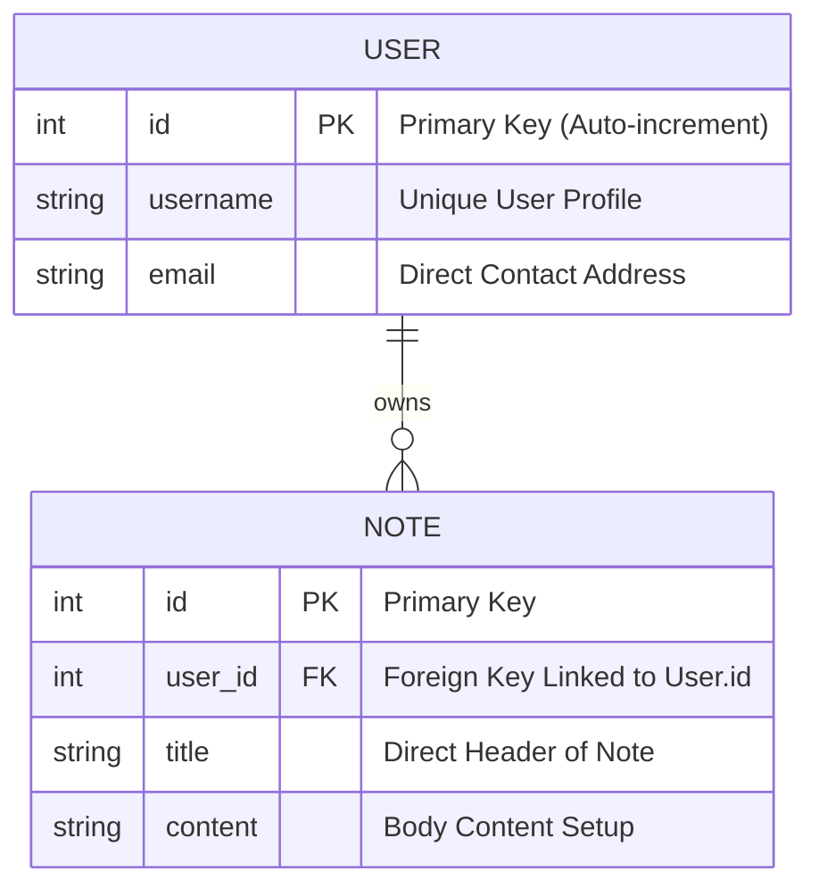

# 🗒️ Notes Manager API

A structured backend service for managing personalized notes, featuring database relationships and full CRUD capabilities.

---

## 📋 Project Scope & Requirements

This project is built to handle specific notes management workflow with:

-   **Notes Management**: An application to create, organize, and store personal notes.
-   **CRUD Operations**: Full functionality for **C**reate, **R**ead, **U**pdate, and **D**elete actions.
-   **ORM Support**: Using Object-Relational Mapping (like SQLAlchemy) for high-level database operations.
-   **Two Relational Tables**:
    -   **User Details**: Stores user items with a unique personal ID.
    -   **Notes Content**: Connects items directly back to the User via a relational key.

---

## 🗄️ Database Architecture

The system utilizes a fully connected relational infrastructure forming a **One-to-Many** linking (One user can own multiple notes).

### 🧬 Entity Relationship Diagram

### 📊 Detailed Schema Breakdown

#### 👤 1. User Table
| Property | Type | Constraint Features | Description |
| :--- | :--- | :--- | :--- |
| `id` | Integer | `PRIMARY KEY` | Unique Identification Tag |
| `username` | String | `UNIQUE`, `NOT NULL` | Profile Login Detail |
| `email` | String | `UNIQUE` | User Point of contact |
| `password` | String | `NOT NULL` | Secure Credential Storage Details |

#### 📝 2. Notes Table
| Property | Type | Constraint Features | Description |
| :--- | :--- | :--- | :--- |
| `id` | Integer | `PRIMARY KEY` | Unique Note Document ID |
| `user_id` | Integer | `FOREIGN KEY` | Reference Key targeting `User.id` |
| `title` | String | `NOT NULL` | Standard Header of your Note Page |
| `content` | Text | `NOT NULL` | Document Body String Setup |

---

## 🛠️ Core CRUD API Routes

Below outlines our operation targets utilizing our backend handlers:

### 👤 User Services
*   **Create User Entry** -> `POST /users/`
*   **Read User State Info** -> `GET /users/{user_id}`

### 📝 Note Services
*   **Create Note Item** -> `POST /notes/` *(Saves note anchored to User ID)*
*   **Read Notes Setup** -> `GET /notes/` *(Fetches list for linked profile)*
*   **Read Note Details** -> `GET /notes/{note_id}`
*   **Update Note Setup** -> `PUT /notes/{note_id}` *(Content/Title modification)*
*   **Delete Note File** -> `DELETE /notes/{note_id}`

---

## 🛠️ Technology Recommendations (Framework setup)
To accurately mirror workflow presets:
*   **App Core Framework**: FastAPI
*   **High-Level ORM**: SQLAlchemy
*   **Database Engine System**: SQLite / PostgreSQL
